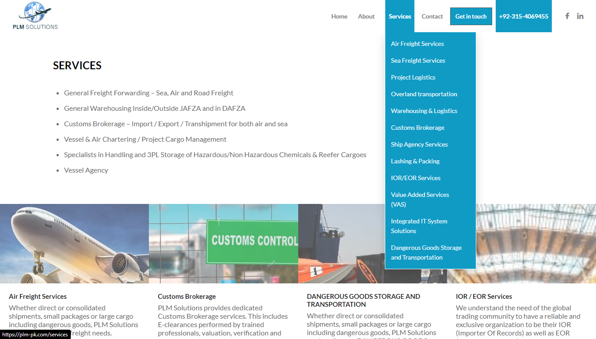
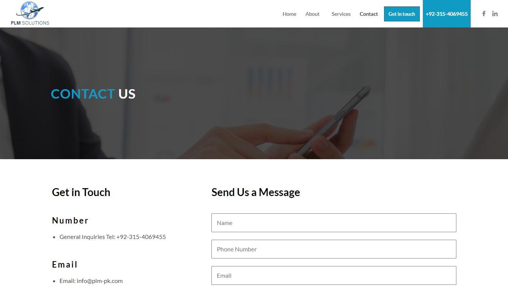

# PLM Solutions Website

This repository contains the source code for the **PLM Solutions Private Limited** website, which I developed from scratch using HTML, CSS, JavaScript, and PHP. The website's design was provided by the client, and I adapted it to be pixel-perfect.

## Features

- **Pixel-Perfect Design**: The client's design was carefully followed to match every detail.
- **Modular PHP Development**: I used modular programming techniques in PHP to create a clean and maintainable codebase.
- **100% Responsive**: The website is fully responsive, ensuring it looks great on all devices, from desktops to mobile phones.
- **Dynamic Contact Page**: A fully functional contact page was built using PHP to handle form submissions.

## Demo

You can view the live demo of the website [here](https://plm-pk.com/).
## Learning Experience

Working on this project provided me with valuable experience in several areas:

- **Responsive Web Design**: I learned how to create a responsive website from scratch, ensuring compatibility across different devices.
- **Modular Programming**: By using modular programming techniques in PHP, I was able to develop the website more efficiently and maintain a clean codebase.
- **PHP Integration**: Implementing PHP to manage various components and create dynamic pages was a key part of this project.

## Screenshots

Here are some previews of the website:

### Desktop View

  
  

  
  

## License

This project is licensed under a **Proprietary License**. All rights are reserved. You may not use, copy, modify, or distribute this code without explicit permission from the author.
